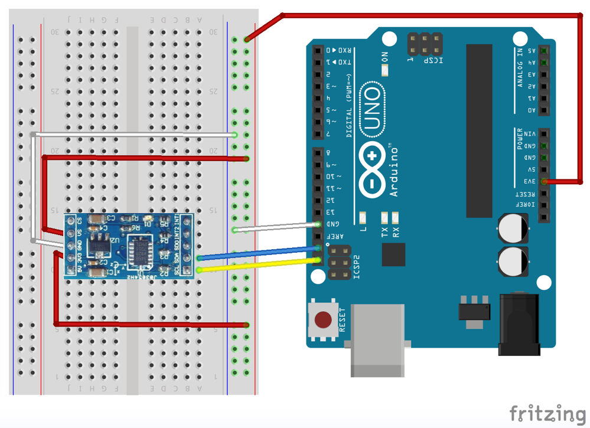
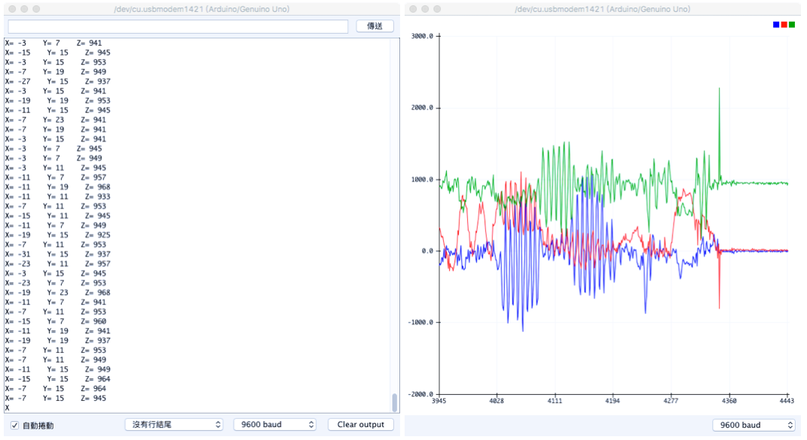

# adxl345_i2c

The adxl345 class was modify and simplify from a project name ADXL345_HelloWorld,
I find it in the mbed.org web site. It seems everyone can get this project, just by
login to mbed online web compiler and select import and click programs tab, 
then search adxl345. You will see a lots of program. By now, count from top, the third 
item is it. But ADXL345_HelloWord is for mbed board, not for Arduino. And it using SPI
interface, not I2C interface.

Wiring

Screenshot

/**
* @author Aaron Berk
* 
* @section LICENSE
*
* Copyright (c) 2010 ARM Limited
*
* Permission is hereby granted, free of charge, to any person obtaining a copy
* of this software and associated documentation files (the "Software"), to deal
* in the Software without restriction, including without limitation the rights
* to use, copy, modify, merge, publish, distribute, sublicense, and/or sell
* copies of the Software, and to permit persons to whom the Software is
* furnished to do so, subject to the following conditions:
*
* The above copyright notice and this permission notice shall be included in
* all copies or substantial portions of the Software.
*
* THE SOFTWARE IS PROVIDED "AS IS", WITHOUT WARRANTY OF ANY KIND, EXPRESS OR
* IMPLIED, INCLUDING BUT NOT LIMITED TO THE WARRANTIES OF MERCHANTABILITY,
* FITNESS FOR A PARTICULAR PURPOSE AND NONINFRINGEMENT. IN NO EVENT SHALL THE
* AUTHORS OR COPYRIGHT HOLDERS BE LIABLE FOR ANY CLAIM, DAMAGES OR OTHER
* LIABILITY, WHETHER IN AN ACTION OF CONTRACT, TORT OR OTHERWISE, ARISING FROM,
* OUT OF OR IN CONNECTION WITH THE SOFTWARE OR THE USE OR OTHER DEALINGS IN
* THE SOFTWARE.
*
* @section DESCRIPTION
*
* ADXL345, triple axis, digital interface, accelerometer.
*
* Datasheet:
*
* http://www.analog.com/static/imported-files/data_sheets/ADXL345.pdf
*/  
